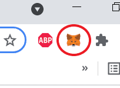
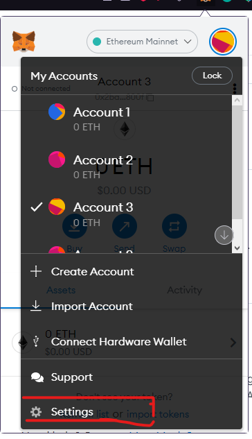
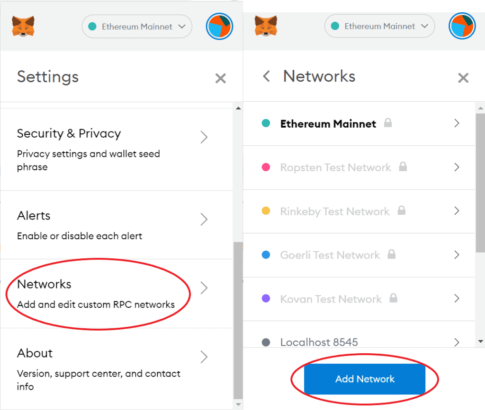
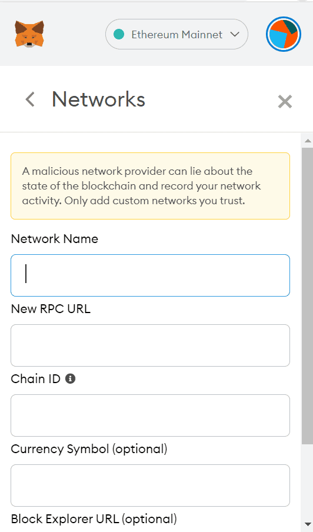
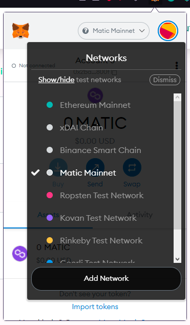

# Connecting to Polygon Network

## Step 1. Open MetaMask

Open your MetaMask browser extension by clicking the top right corner of your Browser.
​

​

## Step 2. Go to settings

Click on the logo of your account at the top right of the MetaMask app. Then click on ‘Settings’.
​

​
​
## Step 3. Go to networks

In the settings window you will see a list of different settings. Click on ‘Network’. In the following list, you will see all the networks that your MetaMask wallet can connect to. Next, click on the ‘Add Network’ button below.

​

## Step 4. Add the network details

MetaMask will now ask you to enter a Network Name, New RPC URL, ChainID, Symbol and Block Explorer URL. To add the Polygon network to your MetaMask wallet, enter the following information:

* Network Name: Matic Mainnet
* New RPC URL: https://polygon-rpc.com/​​
* Chain ID: 137
* Symbol: MATIC
* Block Explorer URL: https://polygonscan.com/

​
## Step 5. Connect your MetaMask to the Polygon network

The last step is to connect your MetaMask wallet to the network. To do this, click on the current network at the top of your MetaMask wallet. Then click on Matic Mainnet.

​
