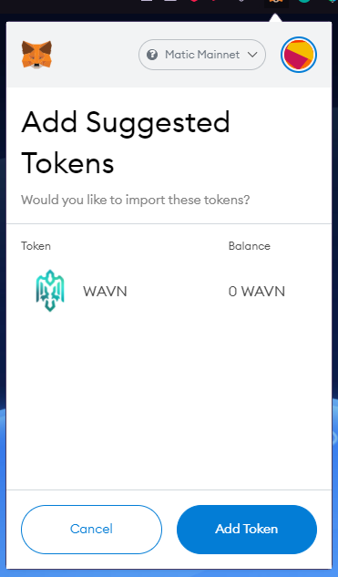

# Adding WAVN to Metamask

Step 1: Head over to the WAVN site

[Wrapped Avian Site ↗](https://wavn.avn.network/) 

Step 2: Add to Metamask Button

Click on Add to MetaMask button, opens MetaMask request to add token.

​
